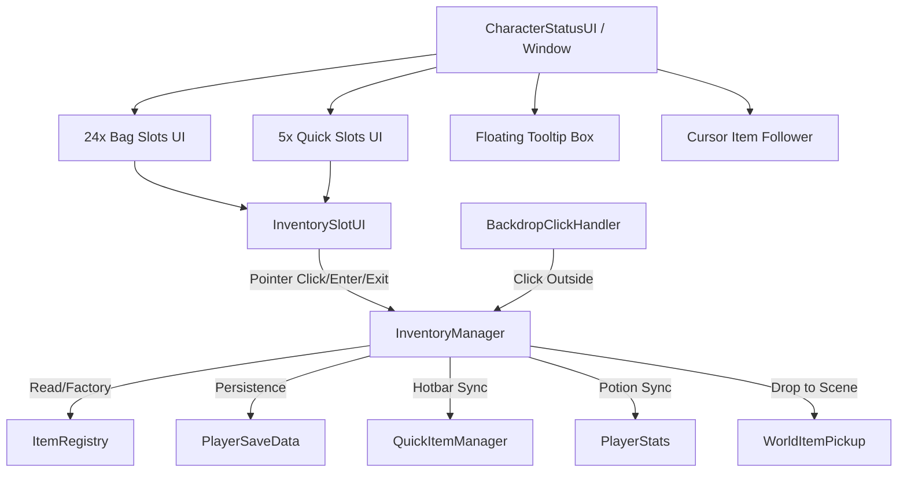

# SYSTEM SPECIFICATION: INVENTORY & ITEM SUBSYSTEM

> Authoring update (2026-09-29): Use `ItemDefinition` assets under `Assets/Resources/Items/Definitions/` to author items and drag a Sprite into `Icon`. These override the legacy catalog below by ID. See [Thai authoring guide](ITEM_AUTHORING_TH.md). `ItemRegistry.cs` remains the compatibility fallback; new items do not require registry edits. `InventoryItemData.canUse` optionally validates consumption before the legacy ID checks.

Rune progression uses four unique one-count item IDs (`rune_pentagram`, `rune_hand`, `rune_eye`, `rune_trident`). Pickups are saved with scene and position; inserting a rune at a gate consumes it and records its socketed state.

> **AI AGENT CONTEXT**: This document provides strict operational parameters, architectural contracts, and reference specifications for the Inventory and Item Subsystem in *The Last Knight*. Any coding agent working on or extending this codebase MUST adhere to the invariants, type contracts, and directory structures defined herein.

---

## 1. Architectural Overview & Component Graph



### Component Roles
- **`InventoryManager`**: Singleton coordinator. Manages 24 inventory slots, 5 quick slots, cursor held item stack, stack splitting, transfers, and persistence.
- **`ItemRegistry`**: Pure factory/catalog defining item IDs, metadata, max stack limits, category, and consumption callbacks.
- **`InventoryItemData`**: Lightweight POCO representing an item instance with runtime stack count and icon resolution.
- **`InventorySlotUI`**: Per-slot UI controller implementing `IPointerClickHandler`, `IPointerEnterHandler`, `IPointerExitHandler`. Controls hover highlight (`Outline` + `Sheen`) and triggers tooltip.
- **`CharacterStatusUI`**: Master UI container hosting native 805x466 window mockup, floating tooltip follower, and cursor icon follower.
- **`WorldItemPickup`**: Physical in-world drop entity with `CircleCollider2D`, pop impulse, ground settling, and sine-wave bobbing.
- **`BackdropClickHandler`**: Raycast receiver outside the window to drop cursor-held items into the world.

---

## 2. Directory Layout & File Location Contracts

```
Assets/
├── Prefabs/
│   └── Items/
│       └── WorldItemPickup.prefab          # Template for world drops (CircleCollider2D + SpriteRenderer)
│
├── Resources/
│   └── CharacterStatus/
│       ├── Item_RedPotion_Clean.png        # Transparent 2D sprite for healing potion (Quick Slot 1)
│       ├── Window_Mockup.png               # Native 805x466 wood window background
│       └── Items/                          # Primary icon library (Sprite type, transparent PNG)
│           ├── Consumables/                # Potions, food, combat elixirs
│           ├── Equipment/                  # Weapons, armor, boots, accessories
│           └── Materials/                  # Shards, seeds, coins, quest tokens
│
└── Scripts/
    └── Inventory/
        ├── InventoryItemData.cs            # Data model class
        ├── ItemRegistry.cs                 # Static item database & factory
        ├── InventoryManager.cs             # State manager & Minecraft drag/drop logic
        ├── InventorySlotUI.cs              # Slot UI component (hover & pointer events)
        ├── WorldItemPickup.cs              # 3D/2D physical world drop controller
        ├── BackdropClickHandler.cs         # Backdrop drop trigger
        └── ITEMS_SYSTEM_GUIDE.md           # Machine & agent specification document
```

---

## 3. Data Contracts & Type Specifications

### `InventoryItemData`
```csharp
namespace TheLastKnight.Inventory
{
    public enum ItemCategory { Consumable, Weapon, Armor, Boots, Accessory, Material, Quest }

    [System.Serializable]
    public class InventoryItemData
    {
        public string id;                      // Unique string identifier (e.g. "potion_heal")
        public string name;                    // User-facing display name
        public string typeName;                // Category label (e.g. "Consumable", "Weapon")
        public string description;             // Gameplay / lore description
        public string iconPath;                // Resources-relative path without extension
        public int count;                      // Current stack quantity (>= 1)
        public int maxStack;                   // Stack limit (1 for gear, 64 for consumables/materials)
        public ItemCategory category;          // Item classification
        public bool isConsumable;              // Whether item can be consumed on use
        public System.Action<PlayerStats> onUse;// Functional callback when used
        public Sprite Icon { get; }            // Lazy-loaded cached sprite via Resources.Load<Sprite>
        public InventoryItemData Clone(int newCount = -1);
    }
}
```

### `InventoryManager` Core State
- **Capacity**:
  - `InventorySlotCount = 24` (`_inventorySlots[0..23]`)
  - `QuickSlotCount = 5` (`_quickSlots[0..4]`)
- **Cursor State**:
  - `CursorHeldItem`: `InventoryItemData` or `null`.
- **Events**:
  - `event Action OnInventoryChanged`: Fired whenever slots or cursor items are modified.

---

## 4. Interaction & Input State Machine

### A. Slot Pointer Actions

| Trigger | Condition | Execution Logic |
| :--- | :--- | :--- |
| **Left Click** | Cursor empty & Slot has item | Pick up entire slot stack into `CursorHeldItem`. Clear slot. |
| **Left Click** | Cursor holds item & Slot empty | Place entire `CursorHeldItem` into slot. Clear cursor. |
| **Left Click** | Cursor & Slot have same item ID | Merge stacks up to `maxStack`. Surplus remains in cursor. |
| **Left Click** | Cursor & Slot have different item IDs | Swap cursor item with slot item. |
| **Right Click**| Cursor empty & Slot has item | Split stack: Cursor gets `ceil(count / 2)`, Slot retains remainder. |
| **Right Click**| Cursor holds item & Slot empty | Deposit 1 item from cursor into slot. |
| **Right Click**| Cursor holds item & Slot has same ID | If slot not full (`count < maxStack`), add 1 to slot, decrement cursor by 1. |
| **Shift + Left**| Any slot with item | **Quick Move**: Instantly moves item between Bag (24 slots) and Quick Slots (5 slots). |

### B. World Drop Mechanics

| Input / Action | Behavior | Target Entity |
| :--- | :--- | :--- |
| **Key `[Q]`** | Drops 1 item from cursor stack into world at player position. | `WorldItemPickup.Spawn(item, dropPos)` |
| **Key `[Ctrl + Q]`** | Drops entire cursor stack into world at player position. | `WorldItemPickup.Spawn(item, dropPos)` |
| **Click Backdrop** | Drops entire cursor stack into world at player position. | `WorldItemPickup.Spawn(item, dropPos)` |
| **Close UI with Held Item** | Automatically returns held item to inventory or drops overflow at player feet. | `InventoryManager.Close()` |

### C. Visual Feedback & Tooltips

1. **Slot Hover State**:
   - `highlightOutline.enabled = true` (`Color(1f, 0.88f, 0.35f, 0.95f)`)
   - `highlightImage.color = Color(1f, 0.95f, 0.65f, 0.35f)`
   - Highlight game object is guaranteed to be topmost within the slot via `SetAsLastSibling()`.
2. **Floating Tooltip**:
   - Dynamic anchored positioning tracking mouse cursor (`ScreenPointToLocalPointInRectangle`).
   - Smart edge flipping: flips left if nearing right canvas bound, flips upward if nearing bottom bound.
   - Non-blocking: `CanvasGroup.blocksRaycasts = false` prevents cursor flicker or input interception.

---

## 5. Item Registry Catalog

All items are statically registered in `ItemRegistry.cs`:

| ID | Name | Category | Max Stack | Icon Path | Primary Effect / Function |
| :--- | :--- | :--- | :---: | :--- | :--- |
| `potion_heal` | `Healing Potion` | Potion | 64 | `CharacterStatus/Items/Cat Fantasy - 32x32 Potion Pack/Potion 1/Potion 1-1` | Restores 30% Max HP + 50 HP immediately. Wired to `[Q]` hotkey. |
| `potion_swiftness` | `Potion of Swiftness` | Potion | 64 | `CharacterStatus/Items/Cat Fantasy - 32x32 Potion Pack/Potion 1/Potion 1-2` | +25% Attack Speed & Movement Speed for 30 seconds. |
| `potion_endurance` | `Potion of Endurance` | Potion | 64 | `CharacterStatus/Items/Cat Fantasy - 32x32 Potion Pack/Potion 1/Potion 1-3` | -25% all Stamina consumption for 30 seconds. |
| `potion_purity` | `Potion of Purity` | Potion | 64 | `CharacterStatus/Items/Cat Fantasy - 32x32 Potion Pack/Potion 1/Potion 1-4` | Immunity to stun and status ailments for 30 seconds. |
| `potion_regeneration` | `Potion of Regeneration` | Potion | 64 | `CharacterStatus/Items/Cat Fantasy - 32x32 Potion Pack/Potion 1/Potion 1-5` | Regenerates 5% Max HP/sec for 30 seconds. |
| `potion_might` | `Potion of Might` | Potion | 64 | `CharacterStatus/Items/Cat Fantasy - 32x32 Potion Pack/Potion 1/Potion 1-6` | +25% Attack Power for 30 seconds. |
| `potion_fortitude` | `Potion of Fortitude` | Potion | 64 | `CharacterStatus/Items/Cat Fantasy - 32x32 Potion Pack/Potion 1/Potion 1-7` | +25% Max HP & DEF for 30 seconds. |
| `potion_undying` | `Potion of the Undying` | Potion | 64 | `CharacterStatus/Items/Cat Fantasy - 32x32 Potion Pack/Potion 1/Potion 1-8` | HP set to 1, no heal, absolute invincibility for 30 seconds. |
| `gold_pouch` | `Gold Pouch` | Consumable | 64 | `CharacterStatus/Items/Item_Pouch` | Grants +500 Gold to player wallet. |
| `moonstone_shard`| `Moonstone Shard` | Material | 64 | `CharacterStatus/Items/craftpix-net-924817-free-crystals-pixel-art-asset-pack/PNG/crystals_black/crystal_black1` | High-tier crafting ingredient. Drops 1 from MoonstoneKeeper. |
| `church_key` | `Moonstone Keeper's Key` | Quest | 1 | `CharacterStatus/Items/Key 13 - GOLD - frame0026` | Unlocks Pentagram chest. |
| `rune_pentagram`| `Pentagram Rune` | Quest | 1 | `CharacterStatus/Items/Item_RunePentagram` | Castle gate demon seal keystone. |
| `rune_hand` | `Demon Hand Rune` | Quest | 1 | `CharacterStatus/Items/Item_RuneHand` | Castle gate demon seal keystone. |
| `rune_eye` | `Evil Eye Rune` | Quest | 1 | `CharacterStatus/Items/Item_RuneEye` | Castle gate demon seal keystone. |
| `rune_trident` | `Trident Rune` | Quest | 1 | `CharacterStatus/Items/Item_RuneTrident` | Castle gate demon seal keystone. |

---

## 6. Implementation Invariants & Guardrails for AI Agents

> [!CAUTION]
> **STRICT AGENT RULES**: Violating any of these rules will degrade UX or corrupt save/load state.

1. **NO AI IMAGE GENERATION**: Do not call `generate_image` for item icons. Use existing clean sprites in `Assets/Resources/CharacterStatus/` or create vector/procedural sprites if authorized.
2. **DEFAULT EMPTY INVENTORY**: By design, default startup inventory grid slots (0..23) must be initialized to `null`. Do not populate starter slots with dummy items. Quick Slot 1 starts with `potion_heal` (3x).
3. **RAYCAST SAFETY**: All floating tooltips and cursor followers must have `blocksRaycasts = false` or `raycastTarget = false`. Failure to do so blocks underlying UI pointer events.
4. **CANVAS RESOLUTION MAPPING**: Native UI window mockup is calibrated to native 805x466 on `CanvasScaler` reference resolution `1280x720`. Slot coordinates must use `ToUI(px, py)` offset calculations.
5. **SYNC INTEGRITY**: Whenever potion counts mutate, `InventoryManager.SyncWithQuickItemManager()` must be invoked to keep `PlayerStats.HealingPotions` and HUD synced.

---

## 7. Verification & Diagnostic Commands

Agents can run the following C# snippets via `execute_code` (`action: "execute"`) in Unity Editor to verify subsystem integrity:

### Test 1: Verify Item Creation & Icon Loading
```csharp
var item = TheLastKnight.Inventory.ItemRegistry.CreateItem("potion_heal", 3);
return $"Item: {item?.name}, Stack: {item?.count}, IconLoaded: {item?.Icon != null}";
```

### Test 2: Verify Inventory Slot Allocation & Quick Move
```csharp
var inv = TheLastKnight.Inventory.InventoryManager.Instance;
inv.InitializeDefaultInventory();
var q0 = inv.GetSlot(TheLastKnight.Inventory.SlotType.QuickSlot, 0);
return $"QuickSlot0: {q0?.name} ({q0?.count}x), BagSlot0: {inv.GetSlot(TheLastKnight.Inventory.SlotType.Inventory, 0)}";
```

### Test 3: Spawn World Item Drop
```csharp
var player = UnityEngine.Object.FindAnyObjectByType<TheLastKnight.Stats.PlayerStats>();
Vector3 pos = player != null ? player.transform.position : Vector3.zero;
var drop = TheLastKnight.Inventory.WorldItemPickup.Spawn(TheLastKnight.Inventory.ItemRegistry.CreateItem("golden_seed", 1), pos);
return $"Drop Spawned: {drop != null}, Pos: {drop?.transform.position}";
```
