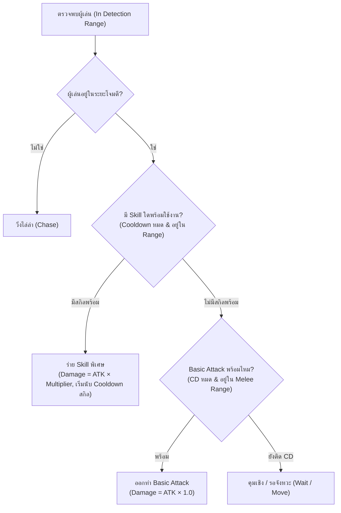

# คู่มือการสร้าง Monster ใน Prefabs และระบบคำนวณ Level (Monster Prefabs & Level Scaling Guide)

คู่มือนี้สรุปขั้นตอนการสร้าง, ตั้งค่า Prefab ของมอนสเตอร์ และการทำงานของระบบ Level Scaling ที่สามารถระบุและคำนวณค่าสเตตัสผ่านหน้าต่าง Unity Inspector ได้โดยตรง สำหรับโปรเจกต์ **The Last Knight**

---

## 1. ตำแหน่งโฟลเดอร์สำคัญ (Key Directories)

* **Prefab ของมอนสเตอร์ทั้งหมด:** `Assets/Prefabs/Enemies/`
  *(เช่น `Skeleton.prefab`, `Goblin.prefab`, `Minotaur_1.prefab`, `UndeadExecutioner.prefab`)*
* **Prefab กระสุน / เวทมนตร์:** `Assets/Prefabs/Enemies/Projectiles/`
  *(เช่น `Goblin_Bomb.prefab`, `Skeleton_Sword.prefab`, `Dragon_FireBall.prefab`)*
* **Animations & Controllers:** `Assets/Animations/Enemies/`
* **สคริปต์ควบคุมระบบ:**
  * [`Assets/Scripts/Combat/EnemyStats.cs`](file:///c:/Users/aldie/Team-Project-The-Last-Knight/Assets/Scripts/Combat/EnemyStats.cs) (ระบบสเตตัส, เลเวล, และการคำนวณอัตโนมัติ)
  * [`Assets/Scripts/AI/EnemyController.cs`](file:///c:/Users/aldie/Team-Project-The-Last-Knight/Assets/Scripts/AI/EnemyController.cs) (ระบบ AI การเคลื่อนที่และโจมตี)
  * [`Assets/Editor/EnemyPrefabBuilder.cs`](file:///c:/Users/aldie/Team-Project-The-Last-Knight/Assets/Editor/EnemyPrefabBuilder.cs) (เครื่องมือสร้างและตั้งค่า Prefab อัตโนมัติ)

---

## 2. โครงสร้างของ Monster Prefab (Prefab Hierarchy & Components)

มอนสเตอร์ 1 ตัวใน Prefab ควรมีโครงสร้าง Hierarchy และ Components ดังต่อไปนี้:

```text
[Monster_Name] (Root GameObject)
 ├── SpriteRenderer
 ├── Animator
 ├── Rigidbody2D
 ├── CapsuleCollider2D (หรือ BoxCollider2D สำหรับ Hurtbox ลำตัว)
 ├── EnemyStats
 ├── EnemyController
 ├── HealthCanvas (Child GameObject - World Space Canvas แสดงหลอดเลือด)
 └── ContactHitbox (Child GameObject - Trigger Collider สำหรับชนทำดาเมจผู้เล่น)
```

### รายละเอียด Components บน Root GameObject:
1. **`SpriteRenderer`**:
   * Sorting Layer: `Default` หรือเลเยอร์ตัวละคร
   * Order in Layer: `2` (อยู่ด้านหน้าฉากหลัง)
2. **`Animator`**:
   * Controller: ใส่ Controller จาก `Assets/Animations/Enemies/<ชื่อมอนสเตอร์>/<ชื่อมอนสเตอร์>Controller.controller`
3. **`Rigidbody2D`**:
   * Body Type: `Dynamic`
   * Collision Detection: `Continuous`
   * Constraints: ติ๊กถูก **Freeze Rotation Z**
   * Gravity Scale: `2.5` (สำหรับมอนสเตอร์เดินดิน) หรือ `0` (สำหรับมอนสเตอร์บินได้ เช่น `FlyingEye`)
4. **`CapsuleCollider2D`**:
   * ใช้เป็น Hitbox ลำตัวสำหรับรับความเสียหาย (รับการโจมตีจากผู้เล่น)
   * ขนาดและ Offset ปรับให้พอดีกับลำตัวมอนสเตอร์
5. **`EnemyStats`**:
   * จัดการ Level, HP, Defense, Attack Power และรางวัล EXP / Gold
6. **`EnemyController`**:
   * จัดการ AI พฤติกรรม: Patrol Speed, Chase Speed, Detection Range, Melee Range และ Prefab กระสุน/เวทมนตร์

---

## 3. ระบบการระบุ Level และการคำนวณสเตตัสใน Inspector

ใน Component **`EnemyStats`** ได้รับการออกแบบให้สามารถระบุ Level ได้โดยตรงผ่านหน้าต่าง Unity Inspector และจะคำนวณค่าสเตตัสให้อัตโนมัติทันที

### การตั้งค่าใน Inspector:
1. เปิด Prefab ของมอนสเตอร์ หรือเลือกตัวมอนสเตอร์ใน Scene
2. ที่ Component **`EnemyStats`** จะพบส่วนหัวข้อ **`Level & Scaling Configuration`**:
   * **`Level`**: กำหนดระดับเลเวลของมอนสเตอร์ (ค่าเริ่มต้นตั้งแต่ `1` ขึ้นไป)
   * **`Use Level Scaling`**: ติ๊กเปิดใช้งานระบบคำนวณสเตตัสตามเลเวลอัตโนมัติ
3. เมื่อพิมพ์เปลี่ยนตัวเลขในช่อง **`Level`** หรือคลิกขวาที่ชื่อคอมโพเนนต์แล้วเลือก **`Apply Level Scaling Formula`**:
   * Unity Editor จะเรียกฟังก์ชัน `OnValidate()` และอัปเดตค่า `Max Health`, `Attack Power`, `Defense`, `EXP Reward` และ `Gold Reward` ให้สอดคล้องกับเลเวลทันที

---

## 4. สูตรความสัมพันธ์ระหว่าง Level กับความเก่ง (Scaling Formulas)

ระบบใช้สูตรตามที่กำหนดไว้ดังนี้:

| ค่าสเตตัส (Stat) | สูตรการคำนวณ (Formula) | คำอธิบาย |
| :--- | :--- | :--- |
| **Max HP** | $\text{Level} \times 100$ | เลือดสูงสุดของมอนสเตอร์ เพิ่มขึ้น 100 ต่อ 1 เลเวล |
| **ATK (Attack Power)** | $\text{Level} \times 10$ | พลังโจมตีพื้นฐาน เพิ่มขึ้น 10 ต่อ 1 เลเวล |
| **DEF (Defense)** | $\text{Level} \times 1$ | พลังป้องกัน เพิ่มขึ้น 1 ต่อ 1 เลเวล |
| **EXP Reward** | $\text{Random}(20\% - 30\% \text{ of } [\text{Level} \times 100])$ | สุ่มค่าระหว่าง $\text{Level} \times 20$ ถึง $\text{Level} \times 30$ |
| **Gold Reward** | $\text{Random}(20\% - 30\% \text{ of } [\text{Level} \times 100])$ | สุ่มค่าระหว่าง $\text{Level} \times 20$ ถึง $\text{Level} \times 30$ |

> [!NOTE]
> เมื่อมอนสเตอร์ตายในเกม (`Die()`) หากเปิดใช้งาน `Use Level Scaling` ระบบจะทำการสุ่มค่า (`RollRewards()`) ใหม่อีกครั้ง ทำให้มอนสเตอร์เลเวลเดียวกันแต่ละตัวดรอป Gold และ EXP ไม่เท่ากัน อยู่ในช่วง 20% - 30% อย่างสมจริง

---

## 5. ตารางตัวอย่างสเตตัสมอนสเตอร์ตาม Level (Lv. 1 - 10)

| Level (Lv.) | Max HP | ATK | DEF | EXP Reward (สุ่ม) | Gold Reward (สุ่ม) |
| :---: | :---: | :---: | :---: | :---: | :---: |
| **Lv. 1** | 100 | 10 | 1 | 20 - 30 | 20 - 30 |
| **Lv. 2** | 200 | 20 | 2 | 40 - 60 | 40 - 60 |
| **Lv. 3** | 300 | 30 | 3 | 60 - 90 | 60 - 90 |
| **Lv. 4** | 400 | 40 | 4 | 80 - 120 | 80 - 120 |
| **Lv. 5** | 500 | 50 | 5 | 100 - 150 | 100 - 150 |
| **Lv. 6** | 600 | 60 | 6 | 120 - 180 | 120 - 180 |
| **Lv. 7** | 700 | 70 | 7 | 140 - 210 | 140 - 210 |
| **Lv. 8** | 800 | 80 | 8 | 160 - 240 | 160 - 240 |
| **Lv. 9** | 900 | 90 | 9 | 180 - 270 | 180 - 270 |
| **Lv. 10** | 1,000 | 100 | 10 | 200 - 300 | 200 - 300 |

---

## 6. ขั้นตอนการสร้าง Monster Prefab ใหม่ทีละสเต็ป (Step-by-Step Creation)

### วิธีที่ 1: สร้าง Prefab ใหม่จากหน้าต่าง Scene
1. คลิกขวาในแถบ **Hierarchy** ➔ เลือก **Create Empty** และตั้งชื่อมอนสเตอร์ (เช่น `Goblin_Lv3`)
2. ใส่ Component:
   * กด **Add Component** ➔ ค้นหา `SpriteRenderer` (เลือก Sprite ท่า Idle เฟรมแรก)
   * กด **Add Component** ➔ ค้นหา `Animator` (ใส่ Animator Controller ของมอนสเตอร์ตัวนั้น)
   * กด **Add Component** ➔ ค้นหา `Rigidbody2D` (ปรับ Gravity และ Freeze Rotation Z)
   * กด **Add Component** ➔ ค้นหา `CapsuleCollider2D` (ปรับขนาดให้คลุมลำตัว)
   * กด **Add Component** ➔ ค้นหา `EnemyStats`
   * กด **Add Component** ➔ ค้นหา `EnemyController`
3. ตั้งค่าสเตตัสใน `EnemyStats`:
   * ติ๊กเปิด **`Use Level Scaling`**
   * ใส่ระดับ **`Level`** ที่ต้องการ (เช่น `3`) สเตตัส HP, ATK, DEF, EXP, Gold จะเปลี่ยนเป็นค่าตามสูตรทันที
4. ลาก GameObject จาก **Hierarchy** ไปปล่อยในโฟลเดอร์ `Assets/Prefabs/Enemies/` เพื่อเซฟเป็น Prefab

### วิธีที่ 2: แก้ไข Prefab ที่มีอยู่แล้ว
1. ไปที่ `Assets/Prefabs/Enemies/` ในหน้าต่าง **Project**
2. ดับเบิ้ลคลิกเปิด Prefab ที่ต้องการแก้ไข (เช่น `Skeleton.prefab`)
3. ในแถบ Inspector ที่ `EnemyStats` ให้ติ๊ก **`Use Level Scaling`** และปรับ **`Level`** ตามต้องการ
4. กดเซฟ Prefab หรือกลับสู่ Scene ปกติ

---

## 7. การเรียกใช้งานผ่านโค้ด C# (Scripting API)

หากต้องการเปลี่ยนเลเวลมอนสเตอร์ผ่านโค้ดในระหว่างเล่นเกม หรือตอน Spawn:

```csharp
using TheLastKnight.Combat;
using UnityEngine;

public class MonsterSpawner : MonoBehaviour
{
    [SerializeField] private GameObject _monsterPrefab;

    public void SpawnMonsterAtLevel(Vector3 position, int targetLevel)
    {
        GameObject enemyObj = Instantiate(_monsterPrefab, position, Quaternion.identity);
        EnemyStats stats = enemyObj.GetComponent<EnemyStats>();
        
        if (stats != null)
        {
            // กำหนด Level และสั่งให้คำนวณสเตตัสใหม่ตามสูตร
            stats.SetLevel(targetLevel, autoRecalculate: true);
        }
    }
}
```

---

## 8. ระบบการออกท่าทาง อนิเมชัน และสกิลของมอนสเตอร์ (Basic Attack & Skill System)

เป้าหมายหลักคือ **ให้มอนสเตอร์แต่ละตัวสามารถออกอนิเมชันได้ครบทุกท่าตามที่ออกแบบไว้ใน Animation Controller** โดยแบ่งหมวดหมู่ท่าทางออกเป็น 2 ประเภทหลัก:

### 1. Basic Attack (ท่าโจมตีพื้นฐาน)
* **เงื่อนไข:** มอนสเตอร์ทุกตัวต้องมีอย่างน้อย 1 ท่า (ส่วนใหญ่ 1 ท่า)
* **ดาเมจ:** ยึดตามค่าสเตตัสพื้นฐานเสมอ คือ **$\text{Damage} = \text{ATK} \times 1.0$**
* **คูลดาวน์:** สั้นและต่อเนื่อง (เช่น 1.2 – 2.0 วินาที) เพื่อใช้กดดันผู้เล่นในระยะปกติ

### 2. Skills (สกิลโจมตีพิเศษ)
* **เงื่อนไข:** นำท่าโจมตีอื่นๆ ที่เหลือใน Animation Controller ทั้งหมดมาตั้งค่าเป็นสกิล (Special Attacks / Spells)
* **การปรับแต่งในหน้าต่าง Inspector:** ผู้ใช้สามารถปรับค่าของแต่ละสกิลได้อิสระรายตัว:
  * **`Animation Trigger / State`**: ระบุชื่อท่าจาก Controller (เช่น `Attack3`, `Skill1`, `Summon`, `Dash`)
  * **`Damage Multiplier`**: ตัวคูณดาเมจจากค่า ATK (เช่น `1.5x`, `2.0x`, `2.5x`)
  * **`Cooldown`**: ระยะเวลาคูลดาวน์เป็นวินาที (เช่น `5s`, `8s`, `12s`)
  * **`Min / Max Range`**: ระยะตรวจจับที่เหมาะสมสำหรับออกท่า (ระยะประชิด 0-1.8m หรือระยะไกล 3-8m)
  * **`Projectile / Spell Prefab`**: วัตถุกระสุนหรือเวทมนตร์ (ถ้าเป็นท่าโจมตีระยะไกล)
  * **`Status Effect`**: สถานะผิดปกติที่แนบมากับการโจมตี (เช่น Stun, Burning, Frozen)



---

## 9. ตารางการตั้งค่าและปรับจูนมอนสเตอร์รายตัว (Individual Monster Tuning Table)

ตารางนี้รวบรวมมอนสเตอร์ทั้งหมด 30 ชนิดในโปรเจกต์ พร้อมจำแนกท่า Basic Attack และ Skills เพื่อเป็นแนวทางให้ผู้ใช้ปรับแต่งตัวคูณดาเมจและคูลดาวน์รายตัวใน Inspector:

### กลุ่มที่ 1: มอนสเตอร์ที่มีหลายท่าโจมตีและมีสกิลพิเศษ (15 ชนิด)

| มอนสเตอร์ | Basic Attack (1.0x ATK) | ท่า Skills (ชื่อท่า, ตัวคูณดาเมจแนะนำ, คูลดาวน์แนะนำ, รูปแบบ) |
| :--- | :--- | :--- |
| **ForestMushroom** | `Attack` (โขกเห็ด 1.0x, CD 1.5s) | • `AttackWithStun` (1.5x ATK, CD 6.0s, ระยะ 1.5m, ติดสถานะ Stun 1.5 วินาที) |
| **Goblin** | `Attack` (ฟันมีดสั้น 1.0x, CD 1.4s) | • `Attack3` (1.6x ATK, CD 5.0s, ระยะ 3.0-7.0m, ขว้างระเบิด `Goblin_Bomb`) |
| **Skeleton** | `Attack` (ฟันดาบ 1.0x, CD 1.5s) | • `Attack3` (1.4x ATK, CD 4.5s, ระยะ 3.0-6.5m, ปาดาบพุ่ง `Skeleton_Sword`)<br>• `Shield` (CD 8.0s, ยกโล่ป้องกันลดดาเมจ 50% ชั่วคราว) |
| **FlyingEye** | `Attack` (พุ่งกัด 1.0x, CD 1.3s) | • `Attack3` (1.5x ATK, CD 5.0s, ระยะ 2.5-7.5m, ยิงกระสุน `FlyingEye_Projectile`) |
| **FantasyMushroom** | `Attack` (กระแทก 1.0x, CD 1.5s) | • `Attack3` (1.4x ATK, CD 5.0s, ระยะ 3.0-7.0m, พ่นสปอร์ `FantasyMushroom_Projectile`) |
| **UndeadExecutioner** *(Mini-Boss)* | `Attack` (ฟันขวานยักษ์ 1.0x, CD 2.0s) | • `Skill1` (2.0x ATK, CD 7.0s, ระยะ 2.2m, หมุนขวานฟันรอบตัวกวาดล้าง)<br>• `Summon` (CD 15.0s, ปักขวานร่ายเวทรอบตัว / เรียกวิญญาณ) |
| **MoonstoneKeeper** | `Attack1` (ต่อยหมัดชุด 1.0x, CD 1.5s) | • `Attack2` (1.8x ATK, CD 6.0s, ระยะ 2.0m, ทุบพื้นสร้างแรงกระแทกหนัก)<br>• `Dash` (1.3x ATK, CD 5.0s, ระยะ 4.0-7.0m, พุ่งทะลวงเข้าใส่ผู้เล่น) |
| **MechaStoneGolem** | `Melee` (ทุบหมัดหิน 1.0x, CD 2.0s) | • `Shoot` (1.5x ATK, CD 5.0s, ระยะ 3.0-8.0m, ยิงหมัดจรวด `Golem_ArmProjectile`)<br>• `LaserCast` (2.5x ATK, CD 10.0s, ระยะ 3.0-9.0m, ยิงลำแสงเลเซอร์ `Golem_Laser`)<br>• `ShieldCast` (CD 12.0s, กางเกราะหินสะท้อน/ลดดาเมจ) |
| **BlueSlime** | `Attack_1` (กระโดดโหม่ง 1.0x, CD 1.2s) | • `Attack_2` (1.3x ATK, CD 3.5s, ระยะ 1.8m, กระโดดสองจังหวะ)<br>• `Attack_3` (1.6x ATK, CD 6.0s, ระยะ 2.2m, พองตัวทับสร้างคลื่น)<br>• `Run+Attack` (1.2x ATK, CD 5.0s, ระยะ 3.0-6.0m, พุ่งสไลด์ชน) |
| **Satyr** | `Attack1` (แทงหอก 1.0x, CD 1.4s) | • `Attack2` (1.4x ATK, CD 4.0s, ฟันเฉือนแนวขวาง)<br>• `Skill1` (1.8x ATK, CD 7.0s, กระโดดถีบสองเท้า)<br>• `Cast / Skill2` (2.0x ATK, CD 9.0s, ร่ายเวทศรธรรมชาติ) |
| **Necromancer** | `Attack1` (ยิงกระสุนวิญญาณ 1.0x, CD 1.5s) | • `Attack2` (1.6x ATK, CD 5.0s, ระยะ 3.0-8.0m, คลื่นพลังมืด)<br>• `Attack3` (2.2x ATK, CD 9.0s, ระยะ 2.0-7.0m, ลำแสงระเบิดวิญญาณ) |
| **SkeletonKnight** | `FwdSwing` (ฟันดาบใหญ่ 1.0x, CD 1.6s) | • `DownSwing` (1.6x ATK, CD 5.0s, ผ่าดาบลงพื้นอย่างแรง)<br>• `SideSwing` (1.3x ATK, CD 4.0s, ฟันกวาดมุมกว้าง)<br>• `FullCombo` (2.2x ATK, CD 9.0s, คอมโบดาบต่อเนื่อง 3 จังหวะ) |
| **DemonBoss** *(Boss)* | `Attack_01` (ตบกรงเล็บ 1.0x, CD 1.8s) | • `Attack_02` (1.8x ATK, CD 5.5s, กวาดกรงเล็บคู่ดาเมจหนัก)<br>• `Jump` (1.6x ATK, CD 8.0s, ระยะ 4.0-8.0m, กระโดดทับแผ่นดินไหว)<br>• `Shout` (CD 12.0s, คำรามข่มขวัญผลักผู้เล่นถอยหลัง/Stun) |
| **BringerOfDeath** | `Attack` (ฟันเคียวมรณะ 1.0x, CD 1.8s) | • `Cast / Spell` (2.0x ATK, CD 8.0s, ระยะ 2.0-8.0m, เสาเพลิงนรกใต้เท้า `BringerOfDeath_Spell`) |
| **Fox** | `Attack` (กระโจนข่วน 1.0x, CD 1.3s) | • `Disappear / Appear` (1.5x ATK, CD 6.0s, ระยะ 3.0-7.0m, หายตัววาร์ปมาโผล่โจมตีด้านหลัง) |

---

### กลุ่มที่ 2: มอนสเตอร์ที่มีท่าโจมตีเดี่ยว หรือยิงกระสุนประจำตัว (15 ชนิด)

| มอนสเตอร์ | ท่าโจมตีหลัก (1.0x ATK) | สกิล / คุณสมบัติเพิ่มเติม |
| :--- | :--- | :--- |
| **ArchDemon** | `BasicAtk` (ฟันพลังอสูร 1.0x, CD 1.8s) | ท่าฟันเดี่ยวหนักแน่น |
| **Demon** | `Attack` (ฟันกรงเล็บปีศาจ 1.0x, CD 1.5s) | โจมตีประชิดรวดเร็ว |
| **DemonKin** | `BasicAtk` (ฟันดาบคู่ 1.0x, CD 1.4s) | โจมตีประชิดมาตรฐาน |
| **Dragon** | `Attack` (กัด 1.0x, CD 1.6s) | • สกิลยิงลูกไฟ `Dragon_FireBall` (1.5x ATK, CD 4.5s, ระยะ 3.0-8.0m) |
| **FireWorm** | `Attack` (พ่นกัด 1.0x, CD 1.4s) | • สกิลยิงลูกไฟ `FireWorm_FireBall` (1.4x ATK, CD 4.0s, ระยะ 2.5-7.0m) |
| **Jinn** | `Attack` (ตบพลังภูติ 1.0x, CD 1.5s) | • สกิลเวทพื้นดิน `Jinn_Magic` (1.8x ATK, CD 6.0s, เสาเวทพุ่งขึ้นจากใต้ดิน) |
| **Lizard** | `Attack` (กัดฟาดหาง 1.0x, CD 1.4s) | โจมตีประชิดตัว |
| **Minotaur_1** | `Attack` (ฟันขวานศึก 1.0x, CD 1.8s) | กวาดขวานประชิดตัวแรง |
| **Minotaur_2** | `Attack` (ทุบกระบอง 1.0x, CD 1.8s) | ทุบกระบองประชิดตัว |
| **Minotaur_3** | `Attack` (ฟาดค้อน 1.0x, CD 1.8s) | ฟาดค้อนหนัก |
| **Reaper** | `HostileAttack` (ฟันเคียว 1.0x, CD 1.6s) | ท่าฟันเคียวกวาดกว้าง |
| **ShadowDemonDragon** *(Boss)* | `Attack_Left / Attack_Right` (1.0x, CD 2.0s) | ท่ากัดและตบตามทิศทางซ้าย-ขวา |
| **Skullwolf** | `Attack` (กระโจนกัด 1.0x, CD 1.2s) | เคลื่อนที่เร็ว กัดประชิดต่อเนื่อง |
| **Small_dragon** | `Attack` (พุ่งชน 1.0x, CD 1.3s) | • สกิลยิงลูกไฟ `SmallDragon_FireBall` (1.3x ATK, CD 4.0s, ระยะไกล) |
| **Trader_1** | *(ไม่มีท่าโจมตี)* | เป็น NPC พ่อค้า (`Approval`, `Dialogue`, `Idle`) |

---

## 10. วิธีการปรับแต่งในหน้าต่าง Unity Inspector (How to Tune in Inspector)

เมื่อเปิด Prefab ของมอนสเตอร์ใน `Assets/Prefabs/Enemies/`:

1. ไปที่ Component **`EnemyController`**
2. ในหัวข้อ **`Basic Attack`**:
   * ตรวจสอบว่า `Damage Multiplier` เป็น `1.0`
   * ปรับ `Cooldown` สำหรับจังหวะฟันธรรมดา (แนะนำ 1.2 – 2.0 วินาที)
   * ปรับ `Max Range` ตามระยะของ Sprite อาวุธ
3. ในหัวข้อ **`Special Skills`** (รายการ Array/List):
   * สามารถกดปุ่ม **`+`** เพื่อเพิ่มสกิล หรือปรับแต่งค่าของสกิลที่มีอยู่:
     * **`Damage Multiplier`**: กำหนดความแรง เช่น `1.5` หมายถึงแรงขึ้น 50% ของค่า ATK
     * **`Cooldown`**: กำหนดเวลาคูลดาวน์ ยิ่งท่าแรงควรตั้งคูลดาวน์ให้สูง (เช่น 6.0 – 10.0 วินาที)
     * **`Max Range`**: ถ้าเป็นท่ายิงไกล ให้ตั้งค่าระยะระหว่าง 6.0 – 8.0 เมตร
4. **การคำนวณร่วมกับ Level:**
   * สกิลทั้งหมดจะคำนวณความเสียหายโดยอิงจาก `EnemyStats.AttackPower`
   * เช่น มอนสเตอร์ **Lv. 5** มี $\text{ATK} = 50$:
     * ท่า Basic Attack $(1.0\times)$ ทำดาเมจ $= 50$
     * ท่า Skill $(2.0\times)$ ทำดาเมจ $= 100$
     * ท่า Laser $(2.5\times)$ ทำดาเมจ $= 125$

---

## 11. ระบบความต่างของเลเวล (Level Difference Penalty / Bonus System)

เพื่อสร้างความท้าทาย ป้องกันไม่ให้ผู้เล่นข้ามไปตีมอนสเตอร์เลเวลสูงเกินไปได้ง่ายๆ และป้องกันไม่ให้ผู้เล่นย้อนกลับมาฟาร์มมอนสเตอร์เลเวลต่ำแบบไร้ความเสี่ยง ระบบจึงมีการคำนวณอัตราทดตามผลต่างของเลเวล ($\Delta \text{Level}$) ดังนี้:

### 1. กรณีมอนสเตอร์เลเวลสูงกว่าผู้เล่น (Under-leveled Damage Penalty)
เมื่อผู้เล่นโจมตีมอนสเตอร์ที่มีเลเวลสูงกว่า ดาเมจสุทธิสุดท้ายที่ทำได้หลังหักลบเกราะ (Final Damage) จะถูกลดทอนลงตามระดับขั้น:

| ผลต่างของเลเวล ($\text{Monster Lv} - \text{Player Lv}$) | อัตราลดทอนดาเมจผู้เล่น | ดาเมจสุทธิที่ทำได้จริง |
| :---: | :---: | :---: |
| **ความต่างน้อยกว่า 5 เลเวล** | ไม่ลดดาเมจ ($0\%$) | **$100\%$** (ดาเมจปกติ) |
| **มอนสเตอร์เลเวล > ผู้เล่น + 5** | ดาเมจสุดท้าย **$-10\%$** | **$90\%$** |
| **มอนสเตอร์เลเวล > ผู้เล่น + 10** | ดาเมจสุดท้าย **$-20\%$** | **$80\%$** |
| **มอนสเตอร์เลเวล > ผู้เล่น + 15** | ดาเมจสุดท้าย **$-30\%$** | **$70\%$** |
| **มอนสเตอร์เลเวล > ผู้เล่น + 20 ขึ้นไป** | ดาเมจสุดท้าย **$-40\%$** | **$60\%$** |

> [!WARNING]
> การลดทอนนี้คำนวณที่ **"ดาเมจสุดท้าย" (Final Damage)** หมายความว่าคำนวณหลังหักลบค่าพลังป้องกัน (`DEF`) ของมอนสเตอร์แล้ว แต่จะยังมีค่าดาเมจขั้นต่ำอย่างน้อย 1 เสมอ (`Mathf.Max(1f, actualDamage)`)

---

### 2. กรณีผู้เล่นเลเวลสูงกว่ามอนสเตอร์ (Over-leveled EXP Penalty)
เมื่อผู้เล่นมีเลเวลสูงกว่ามอนสเตอร์เกินเกณฑ์ที่กำหนด ค่าประสบการณ์ (`EXP Reward`) ที่ได้รับเมื่อมอนสเตอร์ตายจะถูกหักลดทอนโทษ (EXP Penalty) เพื่อผลักดันให้ผู้เล่นเดินทางไปผจญภัยในพื้นที่ใหม่:

| ผลต่างของเลเวล ($\text{Player Lv} - \text{Monster Lv}$) | อัตราหักลดโทษ EXP (Penalty) | ค่า EXP สุทธิที่ได้รับจริง |
| :---: | :---: | :---: |
| **ความต่างน้อยกว่า 5 เลเวล** | ไม่หัก EXP ($0\%$) | **$100\%$** (เต็มจำนวน) |
| **ผู้เล่นเลเวล > มอนสเตอร์ + 5** | หักลด EXP Penalty **$-10\%$** | **$90\%$** ของค่าที่สุ่มได้ |
| **ผู้เล่นเลเวล > มอนสเตอร์ + 10 ขึ้นไป** | หักลด EXP Penalty **$-20\%$** | **$80\%$** ของค่าที่สุ่มได้ |

*(หมายเหตุ: สามารถปรับแต่งค่าเปอร์เซ็นต์หักลดโทษเพิ่มเติมได้ในสคริปต์ `EnemyStats.cs` หากต้องการเพิ่มความเข้มงวดในการฟาร์ม เช่น ลดเหลือ 50% หรือ 10%)*

---

### 3. ตัวอย่างการทำงานในโค้ด C# (`EnemyStats.cs`)

```csharp
// คำนวณลดทอนดาเมจเมื่อมอนสเตอร์เลเวลสูงกว่าผู้เล่น
public void TakeDamage(DamageData damageData)
{
    if (IsDead) return;

    float actualDamage = Mathf.Max(1f, damageData.amount - _defense);

    var player = FindAnyObjectByType<TheLastKnight.Stats.PlayerStats>();
    if (player != null && _useLevelScaling)
    {
        int levelDiff = _level - player.Level;
        if (levelDiff >= 20) actualDamage *= 0.60f;      // -40%
        else if (levelDiff >= 15) actualDamage *= 0.70f; // -30%
        else if (levelDiff >= 10) actualDamage *= 0.80f; // -20%
        else if (levelDiff >= 5)  actualDamage *= 0.90f; // -10%

        actualDamage = Mathf.Max(1f, actualDamage);
    }

    CurrentHealth = Mathf.Max(0f, CurrentHealth - actualDamage);
    // ...
}

// คำนวณหักลดโทษ EXP เมื่อผู้เล่นเลเวลสูงกว่ามอนสเตอร์
private void Die()
{
    // ...
    var player = FindAnyObjectByType<TheLastKnight.Stats.PlayerStats>();
    if (player != null)
    {
        int finalExp = _expReward;
        if (_useLevelScaling)
        {
            int playerAdvantage = player.Level - _level;
            if (playerAdvantage >= 10) finalExp = Mathf.Max(1, Mathf.RoundToInt(_expReward * 0.80f)); // ลด 20%
            else if (playerAdvantage >= 5) finalExp = Mathf.Max(1, Mathf.RoundToInt(_expReward * 0.90f)); // ลด 10%
        }

        player.AddGold(_goldReward);
        player.AddEXP(finalExp);
        FloatingCombatText.Show(transform.position, $"+{_goldReward} Gold / +{finalExp} EXP", Color.yellow);
    }
}
```


