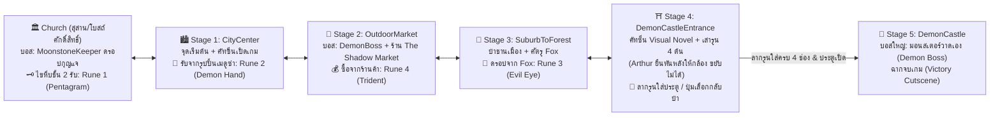

# ⚔️ THE LAST KNIGHT - MASTER DEVELOPMENT PLAN (PLAN.md)
**Project Title:** The Last Knight (อัศวินคนสุดท้าย)  
**Target Deadline:** 30 กันยายน 2026 เวลา 18:00 น.  
**Target Build:** Windows Standalone Build (.exe)  
**Engine & Pipeline:** Unity 6 / URP 2D  

---

## 📌 สรุปข้อตกลงและขอบเขตโปรเจกต์ (Scope & Executive Summary)

แผนงานฉบับนี้ถูกสังเคราะห์ขึ้นจากการตรวจสอบเปรียบเทียบ 3 แหล่งข้อมูลหลัก:
1. **เอกสารนำเสนอโครงงานฉบับเต็ม (`D:\Downloads\the last knight project.pdf`):** รวม 39 สไลด์ ซึ่งครอบคลุมระบบการเล่นทั้งหมด
2. **เงื่อนไขสำคัญที่อาจารย์ที่ปรึกษาให้ปรับปรุง (สไลด์หน้า 39):**
   - ✅ **5 ด่านหลักที่เชื่อมต่อกัน (Metroidvania Interconnected World)**
   - ✅ **มอนสเตอร์วาดเอง (Custom Drawn Monster)** ประจำการเป็นบอสใหญ่ใน Demon Castle (วาดเอง 1 ตัวตามที่ผู้ใช้สรุป)
   - ✅ **ระบบรวบรวมไอเทมเพื่อจบเกม (Item Collection Win Condition):** รวบรวมรูนโบราณ 4 ชิ้น (Demon Runes) เพื่อปลดล็อคประตูปราสาทสู่บอสใหญ่
3. **สถานะโค้ดปัจจุบันในโปรเจกต์:** ฟิสิกส์ตัวละครและแผนที่พร้อมแล้วบางส่วน แต่ยังขาด Hitbox ทำดาเมจ, ระบบ Parry, ระบบสเตมิน่า, ร้านค้า, จุดเซฟ, และระบบเสียง

---

## 🛡️ การอุดช่องโหว่ทางเทคนิคและเกมเพลย์ (Blindspot Mitigations)

| ลำดับ | ช่องโหว่ที่อาจเกิดขึ้น (Potential Blindspots) | แนวทางป้องกันและอุดช่องโหว่ (Mitigation Strategy) |
| :---: | :--- | :--- |
| **B1** | **ข้อมูลผู้เล่นสูญหายขณะเปลี่ยนแมพ (Scene Transition Data Loss)** | สร้าง `GameManager.cs` ที่เป็น `DontDestroyOnLoad` คอยเก็บสถานะ HP, Stamina, EXP, Level, Gold, รูนที่เก็บได้, และขวดโพชั่นอย่างต่อเนื่อง ไม่พึ่งพาตัวแปรใน Scene เดี่ยวๆ |
| **B2** | **บั๊กฟิสิกส์การชนและเลเยอร์ตีไม่โดน (Physics Matrix & Layer Collision)** | กำหนด Layer ให้ชัดเจน: `Player`, `PlayerAttack`, `Enemy`, `EnemyAttack`, `Ground`, `Interactable` และตั้งค่า Layer Collision Matrix ใน `Physics2DSettings.asset` ให้ไม่ชนมั่ว |
| **B3** | **ความเหลื่อมของจังหวะ Parry จากเฟรมเรต (Frame-rate Dependent Parry)** | ใช้วิธีคำนวณวงกลมหดตัวแบบ Normalized Time (0.0 ถึง 1.0) อิงตาม `Time.deltaTime` และตั้งค่า Perfect Window ไว้ที่ 0.15 - 0.20 วินาที เพื่อให้แม่นยำเท่ากันทุกเครื่อง |
| **B4** | **ผู้เล่นวิ่งหนีออกจากห้องบอสข้ามแมพได้ (Boss Fight Exploits)** | เมื่อเข้าสู่เขต Boss Arena ประตูทางเข้าและทางออกจะถูกปิดผนึกด้วยม่านพลังสีแดงทันที และจะเปิดออกเมื่อบอสตายแล้วเท่านั้น |
| **B5** | **Save File เสียหายหรือบันทึกไม่ครบ (Save/Load Data Corruption)** | ใช้โครงสร้าง JSON Serializer พร้อมบันทึก Checksum ลงใน `Application.persistentDataPath` มีระบบ Fallback โหลดค่าเริ่มต้นหากไฟล์เสียหาย |
| **B6** | **ปัญหาลิขสิทธิ์เสียงในงานส่งอาจารย์ (Academic Audio Licensing Issue)** | ใช้เฉพาะเสียง Public Domain / Creative Commons 0 (CC0) หรือ Royalty-Free เท่านั้น พร้อมสร้างไฟล์ `Assets/Audio/CREDITS.md` บันทึกลิ้งก์ที่มาและใบอนุญาตของทุกไฟล์เสียง |

---

## 🗺️ การจัดวาง 5 ด่านหลัก, บอส และรูนทั้ง 4 ชิ้น (World Layout & Boss Matrix)

ตามมติที่ตกลงและข้อกำหนดของอาจารย์:

---

## 🌿 กฎการตั้งชื่อ Branch และขั้นตอนการพัฒนา (Git Branching Rules)

### Task Classification Rule
- `feature/<ชื่อของงาน>`: สำหรับการสร้างระบบเกม, ตรรกะโปรแกรมมิ่ง, หรือกลไกใหม่
- `art/<ชื่อของงาน>`: สำหรับงานภาพกราฟิก, จัดฉาก, อนิเมชัน, และไฟล์เสียง SFX/BGM
- `bugfix/<ชื่อของปัญหา>`: สำหรับการแก้บั๊ก, ปรับบาลานซ์, และแก้ไขความผิดพลาด

### Sequential Workflow
1. แตก Branch ใหม่จาก `main` (หรือ branch ล่าสุดที่ merge แล้ว)
2. พัฒนาฟีเจอร์ให้ผ่าน **"Success Condition"** ของเป้าหมายนั้นๆ
3. ตรวจสอบว่าไม่มี Compile Error ใน Unity Console
4. ทำการ `git add .` -> `git commit -m "<รายละเอียดงาน>"` -> `git push origin <branch-name>`
5. สร้าง Pull Request หรือ Merge เข้า `main` ก่อนเริ่มงานถัดไป

---

## 🎯 แผนปฏิบัติการแบ่งเป้าหมายย่อย (Milestones & Sprint Tasks)

### 🚩 Milestone 0: Baseline Commit & Project Foundation
* **Deadline:** 19 กันยายน 2026 (23:59 น.)
* **Branch:** `bugfix/layer` -> `main`

#### Task 0.1: บันทึกและเคลียร์สถานะ Git ปัจจุบัน
- **Branch:** `bugfix/layer`
- **ประเภทงาน:** `bugfix/cleanup-layer-and-prefabs`
- **สิ่งที่ต้องทำ:**
  - ตรวจสอบไฟล์ที่ค้างใน working tree (Prefabs, Scene, InputHandler)
  - Commit การเปลี่ยนแปลงทั้งหมดใน branch `fixbug/layer`
  - Push ขึ้น remote และรวม (Merge) เข้าสู่ `main`
- **Success Condition:**
  - `git status` ใน branch `main` สะอาด (clean working tree)
  - ทุก Scene ใน `Assets/Scenes/Maps/` โหลดได้โดยไม่มี Missing Prefab หรือ Missing Script

---

### 🚩 Milestone 1: Core Combat, Parry & Stamina System
* **Deadline:** 21 กันยายน 2026 (23:59 น.)
* **เป้าหมายหลัก:** ทำให้ Arthur โจมตีมอนสเตอร์ได้จริง, มีระบบแพรี่ตามสไลด์หน้า 5/9, และระบบ Stamina แบบครบวงจร

#### Task 1.1: ระบบทำดาเมจของผู้เล่น (Player Attack Hitbox & Damage Pipeline)
- **Branch:** `feature/player-attack-hitbox`
- **สิ่งที่ต้องทำ:**
  - เพิ่ม Collider Hitbox สำหรับการฟันดาบของ Arthur
  - เชื่อมโยงเข้ากับ `IDamageable` และ `EnemyStats.TakeDamage()`
  - ดึงค่า `AttackPower` และ `CriticalChance` จาก `PlayerStats` มาคำนวณดาเมจ
  - เพิ่ม Floating Damage Number (ตัวเลขดาเมจลอย) เวลาโจมตีโดน
- **Success Condition:**
  - Arthur ฟันมอนสเตอร์ (เช่น Slime หรือ Golem) แล้วเลือดมอนสเตอร์ลดจริง
  - มอนสเตอร์เลือดเหลือ 0 แล้วเล่นแอนิเมชันตายและหายไป
  - ตัวเลขดาเมจลอยขึ้นตามค่าพลังโจมตี

#### Task 1.2: ระบบ Parry (แพรี่) พร้อมวงกลมจับจังหวะ
- **Branch:** `feature/parry-system`
- **สิ่งที่ต้องทำ:**
  - สร้าง `ParryReceiver.cs` บนตัวศัตรู: เมื่อศัตรูเริ่มง้างท่าโจมตี จะมีวงกลมสีเหลืองหดลงมาหาตัวศัตรู
  - เมื่อผู้เล่นกดโจมตี (คลิกซ้าย) ตรงจังหวะที่วงกลมหดทับพอดี (Perfect Window 0.2 วินาที):
    - ยกเลิกท่าโจมตีของศัตรูทันที (Attack Cancelled)
    - ศัตรูติดสถานะชะงัก (Stagger) นิ่งไป 1.5 วินาที
    - การโจมตีซ้ำในช่วง Stagger จะติด Critical Hit 100%
  - ผูกกับโหมดความยาก: ซ่อนวงกลมเตือนในโหมด Hard
- **Success Condition:**
  - เมื่อศัตรูง้างตี วงกลมสีเหลืองแสดงและหดตัวอย่างราบรื่น
  - กดคลิกซ้ายตรงจังหวะแล้วมีเสียงกระทบโลหะ ศัตรูนิ่งชะงัก ไม่สร้างดาเมจใส่ผู้เล่น

#### Task 1.3: ระบบ Stamina (STM 100 หน่วย) และการฟื้นฟู
- **Branch:** `feature/stamina-system`
- **สิ่งที่ต้องทำ:**
  - เพิ่มตัวแปร `MaxStamina` (100) และ `CurrentStamina` ใน `PlayerStats`
  - การกระทำที่ลดสเตมิน่า:
    - Sprint (วิ่งเร็ว): ลดต่อเนื่อง 15 STM/วินาที
    - Normal Attack (ฟันปกติ): ลด 15 STM/ครั้ง
    - Dash (พุ่งตัว): ลด 20 STM/ครั้ง
    - Skill E (Carnage Burst): ลด 25 STM/ครั้ง
    - Skill T (Excalibur): ลด 50 STM/ครั้ง
  - ฟื้นฟูสเตมิน่าอัตโนมัติเมื่อหยุดใช้สกิล (20 STM/วินาที)
  - เพิ่มความเร็วการฟื้นฟูเป็น 2 เท่า (40 STM/วินาที) เมื่อยืนอยู่ในรัศมีของรูปปั้นเมดูซ่า (Save Point)
  - ปรับปรุง UI HUD ให้มีหลอดสีเขียวแสดงค่า STM ควบคู่กับหลอดเลือด
- **Success Condition:**
  - เมื่อ Stamina หมด จะไม่สามารถ Dash หรือใช้สกิล E/T ได้
  - หลอด STM บน HUD ลดและฟื้นฟูตรงตามการกระทำ
  - ยืนใกล้รูปปั้นเมดูซ่าแล้วหลอด STM เด้งกลับเต็มอย่างรวดเร็ว

---

### 🚩 Milestone 2: Quick-Slot Potions, The Shadow Market & Economy
* **Deadline:** 23 กันยายน 2026 (23:59 น.)
* **เป้าหมายหลัก:** ระบบเก็บ Gold จากมอนสเตอร์, ร้านค้าของพ่อค้าใน OutdoorMarket, และกดปุ่ม Q เพื่อดื่มยาฟื้นเลือด

#### Task 2.1: ระบบเศรษฐกิจและการดรอป Gold / EXP
- **Branch:** `feature/monster-loot-economy`
- **สิ่งที่ต้องทำ:**
  - เมื่อมอนสเตอร์ตาย ดรอป EXP และ Gold ลอยเข้าหาตัวผู้เล่น (ตามสไลด์หน้า 34: `+15exp`, `+8gold`)
  - อัปเดตตัวแปร `Gold` ใน `PlayerStats` และแสดงยอดเงินคงเหลือบนหน้าจอ
- **Success Condition:**
  - สังหารมอนสเตอร์แล้วมีไอคอน/ข้อความทองและ EXP เด้งขึ้น และยอด Gold ในตัวเพิ่มขึ้นถูกต้อง

#### Task 2.2: ระบบ Quick-Slot ดื่มยาฟื้นเลือด (Key Q)
- **Branch:** `feature/quickslot-potion`
- **สิ่งที่ต้องทำ:**
  - กำหนดตัวแปร `HealingPotionCount` (เริ่มต้น 3 ขวด สูงสุด 5 ขวด)
  - กดปุ่ม **Q**: หากมียาเหลือ จะเข้าสู่ State `Drinking` เล่นแอนิเมชันดื่มยา 2.5 วินาที
  - เมื่อดื่มเสร็จ ฟื้นฟู HP 50 หน่วย (หรือตามประเภทโพชั่น)
  - แสดงไอคอนขวดยาพร้อมจำนวนตัวเลขบน HUD มุมล่าง
- **Success Condition:**
  - กด Q ตัวละครหยุดวิ่งและเล่นท่าดื่มยา เลือดเด้งเพิ่ม 50 หน่วย และขวดยาลดลง 1 ขวด

#### Task 2.3: ร้านค้า The Shadow Market (Outdoor Market NPC)
- **Branch:** `feature/shadow-market-shop`
- **สิ่งที่ต้องทำ:**
  - ติดตั้ง NPC พ่อค้าที่ฉาก `OutdoorMarket`
  - เมื่อ Arthur เดินเข้าไปใกล้ มีปุ่ม Prompt "กด F เพื่อเปิดร้านค้า"
  - หน้าต่างร้านค้าแบบ UI Toolkit / Canvas:
    - **Rune of the Trident (รูนที่ 4):** ไอเทมสำคัญราคา 150 Gold (เงื่อนไขจำเป็นในการปลดประตูปราสาท)
    - **Medium Healing Potion:** (ราคา 50 Gold) -> เพิ่มจำนวนขวดยาฟื้นเลือด
    - **Potion of STR / VIT / AGI / DEX:** (ขวดละ 100 Gold) -> เพิ่มแต้มสเตตัสนั้นๆ ทันที
  - หักเงิน Gold ตามจริงและอัปเดตสถานะตัวละคร บันทึกว่าซื้อรูนที่ 4 แล้ว
- **Success Condition:**
  - กด F หน้าร้านค้าแล้วเมนูเด้งขึ้นมากดซื้อไอเทมและ Rune of the Trident ได้ เงินลด ไอเทม/รูนเพิ่ม และปิดหน้าต่างกลับมาเล่นต่อได้ปกติ

---

### 🚩 Milestone 3: Boss Encounters, 4 Runes System & Map Traversal
* **Deadline:** 25 กันยายน 2026 (23:59 น.)
* **เป้าหมายหลัก:** วางมอนสเตอร์ตามตำแหน่งที่ตกลง, ระบบสะสมรูน 4 ชิ้น, และประตู DemonCastleGate

#### Task 3.1: วางมอนสเตอร์และบอสประจำ 5 แมพ
- **Branch:** `feature/map-bosses-placement`
- **สิ่งที่ต้องทำ:**
  - **Church:** วางบอส `MoonstoneKeeper` (ดรอปกุญแจโบสถ์ Church Key) + สร้างหีบสมบัติที่ชั้น 2 สำหรับเก็บ Rune 1
  - **CityCenter:** ม็อบพื้นฐาน (BlueSlime, Skeleton) + จุดเซฟรูปปั้นเมดูซ่า (มอบ Rune 2)
  - **OutdoorMarket:** วางบอส `DemonBoss` + NPC พ่อค้า The Shadow Market (ขาย Rune 4)
  - **SuburbToForest:** วางศัตรูลาดตระเวน `Fox` (เมื่อกำจัดได้จะดรอป Rune 3) + FireWorm / Mushroom
  - **DemonCastleEntrance:** ฉากคัทซีนกึ่ง Visual Novel ทางเข้าปราสาท เสารูน 4 ต้น (Arthur ขยับไม่ได้ ยืนหันหลังให้กล้องมองดูประตูใหญ่)
  - **DemonCastle:** บอสใหญ่ห้องสุดท้าย: **มอนสเตอร์วาดเอง (Demon Boss)**
- **Success Condition:**
  - แต่ละแมพมีบอส มอนสเตอร์ และจุดรับรูนประจำการตามตำแหน่งที่ระบุถูกต้องครบถ้วน

#### Task 3.2: ระบบสะสมรูนทั้ง 4 ชิ้น (Demon Runes Acquisition System)
- **Branch:** `feature/demon-runes-progression`
- **สิ่งที่ต้องทำ:**
  - เชื่อมโยง `DemonRuneManager.cs` เข้ากับระบบรับไอเทมทั้ง 4 แหล่ง:
    - **Rune 1 (Pentagram):** อยู่ในหีบสมบัติชั้น 2 ของฉาก Church (ผู้เล่นต้องปราบบอส MoonstoneKeeper เพื่อเก็บกุญแจมาเปิดหีบ)
    - **Rune 2 (Demon Hand):** ได้รับจากจุดเซฟรูปปั้นเมดูซ่าในฉาก CityCenter (เมื่อผู้เล่นกด F พักผ่อน/สำรวจรูปปั้น)
    - **Rune 3 (Evil Eye):** ดรอปอัตโนมัติจากศัตรู Fox ในป่า SuburbToForest เมื่อสังหารสำเร็จ
    - **Rune 4 (Trident):** ซื้อจากร้านค้า The Shadow Market ในฉาก OutdoorMarket (ราคา 150 Gold)
  - มี Notification และเสียงเตือนเมื่อได้รับรูนแต่ละชิ้น พร้อมบันทึกลงตัวแปรของ `DemonRuneManager`
- **Success Condition:**
  - ผู้เล่นสามารถรับรูนครบทั้ง 4 ชิ้นจาก 4 แหล่งที่ระบุ และระบบตรวจจับว่ามีรูนครบ (`HasAllRunes == true`)

#### Task 3.3: ประตูปราสาทฉาก Visual Novel (Demon Castle Entrance VN Interactive Scene)
- **Branch:** `feature/demon-castle-gate-vn`
- **สิ่งที่ต้องทำ:**
  - ออกแบบฉาก `DemonCastleEntrance` ในสไตล์ Visual Novel / Interactive Narrative:
    - **สถานะ Player:** ปิดระบบควบคุมการเคลื่อนไหวของผู้เล่น (Input disabled ผู้เล่นขยับไม่ได้) โดยตัวละคร Arthur จะยืนอยู่ตรงกลาง-ล่างของหน้าจอในท่า **"หันหลังให้กล้อง" (Back facing camera)** ยืนสงบนิ่งมองไปยังประตูมหายักษ์
    - แสดงภาพพื้นหลังบานประตูปราสาทขนาดใหญ่พร้อมเสาหิน 4 ด้าน
    - กล่องข้อความบรรยาย (VN Dialogue Box) อธิบายถึงมนต์สะกดที่ต้องใช้รูนทั้ง 4 ชิ้น
    - **ปุ่มตัวเลือกที่ 1:** "กลับไปยังป่า SuburbToForest" (คลิกแล้ววาร์ปกลับไปฉาก SuburbToForest ทันที)
    - **ปุ่มตัวเลือกที่ 2 / หน้าต่างสัมผัส:** เปิดกระเป๋า/ช่องเก็บของ แสดงรูนที่ผู้เล่นมีอยู่ และรองรับการ "ลาก (Drag & Drop)" หรือคลิกสวมใส่ Rune ลงในเบ้าหินของประตูทั้ง 4 ช่อง
    - **Visual Feedback:** เมื่อใส่รูนลงช่อง เสาต้นนั้นจะส่องแสงและมีเสียงผนึกคลาย
    - เมื่อใส่ครบทั้ง 4 เสา: เกิดแผ่นดินไหว ประตูใหญ่เปิดออกอย่างช้าๆ ตัดเข้าสู่ฉาก `DemonCastle` (ห้องบอสใหญ่)
- **Success Condition:**
  - ในฉาก DemonCastleEntrance ตัวละคร Arthur ยืนหันหลังให้กล้องและไม่สามารถขยับหรือกระโดดได้
  - ฉากทำงานแบบ Visual Novel มีบทสนทนา สามารถกดย้อนกลับไปป่าได้
  - สามารถลากรูนทั้ง 4 ชิ้นจากช่องเก็บของไปใส่เบ้าประตูได้จริง และประตูจะเปิดเมื่อใส่ครบ 4 รูนเท่านั้น

---

### 🚩 Milestone 4: Audio System, Save/Respawn & Cutscenes
* **Deadline:** 27 กันยายน 2026 (23:59 น.)
* **เป้าหมายหลัก:** ระบบเสียงครบทุกส่วนพร้อมเอกสารอ้างอิง, จุดเซฟรูปปั้นเมดูซ่า, และคัทซีนเปิด-ปิดเกม

#### Task 4.1A: ค้นหาคลังเสียงและทำเอกสารลิขสิทธิ์ (Audio Sourcing & Licensing Credits)
> **[มอบหมายให้เพื่อนร่วมทีมคนที่ 1 - AI AGENT ห้ามทำส่วนนี้]**
- **ผู้รับผิดชอบ:** เพื่อนร่วมทีมคนที่ 1
- **Branch:** `art/audio-assets-and-credits`
- **โฟลเดอร์เป้าหมาย:** `Assets/Audio/SFX/`, `Assets/Audio/BGM/`, `Assets/Audio/CREDITS.md`
- **สิ่งที่ต้องทำ:**
  - ค้นหาและดาวน์โหลดไฟล์เสียงฟรี (CC0 / Public Domain / Royalty Free) ตามรายการ:
    - **Player SFX:** ดาบฟัน, แดช, กระโดด, ตกกระทบ, ร้องเจ็บ, เสียงดื่มยา, เสียงระเบิด Carnage Burst, ลำแสง Excalibur
    - **Enemy SFX:** สไลม์โดด, มอนสเตอร์คำราม, โดนดาเมจ, บอสตาย
    - **UI SFX:** ปุ่มกด, เสียงแพรี่ติด, เสียงเก็บรูน, Game Over
    - **5 BGM Tracks:** เพลงเมือง/ตลาด, เพลงป่า, เพลงโบสถ์กอทิก, เพลงปราสาท, เพลงบอสใหญ่
  - สร้างไฟล์ `Assets/Audio/CREDITS.md` บันทึกรายชื่อและ URL อ้างอิงของทุกไฟล์เสียง
- **Success Condition:**
  - ไฟล์เสียงทั้งหมดถูกจัดหมวดหมู่ใน `Assets/Audio/` และมีเอกสาร `CREDITS.md` ครบถ้วน

#### Task 4.1B: เขียนโค้ดระบบเสียงและเชื่อมต่อเอฟเฟกต์ (AudioManager Script & Audio Integration)
> **[AI AGENT รับผิดชอบทำส่วนนี้ - ยังคงทำอยู่]**
- **ผู้รับผิดชอบ:** AI Agent
- **Branch:** `feature/audio-manager-integration`
- **ไฟล์เป้าหมาย:** `Assets/Scripts/Audio/AudioManager.cs`, `PlayerController.cs`, `EnemyStats.cs`, `HUDController.cs`
- **สิ่งที่ต้องทำ:**
  - สร้าง `AudioManager.cs` ทำหน้าที่ Singleton (`DontDestroyOnLoad`) ควบคุม Master Volume, Fade BGM ข้ามฉาก, และเล่น SFX One-Shot
  - เชื่อมโยง Trigger เสียงในโค้ด: เสียงฟันดาบ, กระโดด, แดช, ดื่มยา, สกิล E/T, เสียงมอนสเตอร์โดนตี/ตาย, และเสียง UI
- **Success Condition:**
  - ระบบ AudioManager ทำงานได้สมบูรณ์ ไม่มี Error และมีเสียงดังขึ้นเมื่อเกิดการกระทำในเกม

#### Task 4.2: จุดเซฟรูปปั้นเมดูซ่า & ระบบ Respawn (Save System)
- **Branch:** `feature/medusa-save-respawn`
- **สิ่งที่ต้องทำ:**
  - วาง Prefab รูปปั้นเมดูซ่าใน CityCenter และหน้าทางเข้าปราสาท
  - เดินไปใกล้รูปปั้น มีข้อความ "กด F เพื่อพักผ่อนและบันทึกเกม"
  - เมื่อกด F:
    - ฟื้นฟู HP และ STM จนเต็ม 100%
    - บันทึกพิกัดฉาก, ค่าสเตตัส, เลเวล, รูน, และขวดยาลง JSON
  - เมื่อ Arthur ตาย: แสดงหน้าจอ "YOU DIED" พร้อมปุ่ม `RESPAWN` (โหลดกลับมาจุดเซฟล่าสุด) และ `EXIT`
- **Success Condition:**
  - กด F ที่รูปปั้นแล้วเลือดเต็ม ปิดเกมเปิดใหม่สามารถโหลดต่อจากจุดเซฟได้ เมื่อตายกด Respawn แล้วฟื้นที่รูปปั้น

#### Task 4.3: คัทซีนเนื้อเรื่องและกล่องข้อความบรรยาย (Story Cutscenes)
- **Branch:** `feature/story-dialogue-system`
- **สิ่งที่ต้องทำ:**
  - สร้าง `DialogueBoxUI` ที่รองรับภาพตัวละครและข้อความบรรยาย
  - **ฉากเปิด (Intro Cutscene):** แสดงบทบรรยายของ Arthur เรื่องอาณาจักรโมอาที่ล่มสลาย ก่อนปล่อยให้ผู้เล่นเริ่มเดินใน CityCenter
  - **ฉากจบ (Victory Cutscene):** เมื่อปราบมอนสเตอร์วาดเองใน Demon Castle ได้ ตัดเข้าสู่ภาพ Arthur มองดูอาณาจักรที่กำลังฟื้นฟู พร้อมข้อความจบเกม
  - รองรับการกด Spacebar หรือคลิกเมาส์เพื่อเลื่อน/ข้ามข้อความ
- **Success Condition:**
  - เริ่มเกมมีคัทซีนเล่าเรื่องเปิดหัว และเมื่อปราบปราสาทบอสได้มีคัทซีนปิดฉากบริบูรณ์

---

### 🚩 Milestone 5: Difficulty Modes & Main Menu Flow
* **Deadline:** 29 กันยายน 2026 (23:59 น.)
* **เป้าหมายหลัก:** เมนูหน้าแรกและการเลือกระดับความยาก 3 โหมดที่ส่งผลต่อเกมเพลย์ตามหน้า 8/9 ของ PDF

#### Task 5.1: เลือกระดับความยาก (Easy, Normal, Hard)
- **Branch:** `feature/difficulty-system`
- **สิ่งที่ต้องทำ:**
  - สร้าง `GameDifficultyManager.cs`:
    - **Easy:** แสดงเลเวลมอนสเตอร์, แสดงหลอดเลือดบนหัว, แสดงวงกลมช่วยแพรี่
    - **Normal:** ดาเมจมอนสเตอร์ +30%, ดาเมจตัวเอก -30%, แสดงหลอดเลือดและวงกลมแพรี่
    - **Hard:** ดาเมจมอนสเตอร์ +60%, ดาเมจตัวเอก -60%, สเตมิน่า/เลือดฟื้นช้าลงครึ่งหนึ่ง, ซ่อนหลอดเลือดและซ่อนวงกลมแพรี่ทั้งหมด
- **Success Condition:**
  - เมื่อเลือกโหมด Hard มอนสเตอร์ตีแรงขึ้นอย่างชัดเจน และไม่มี UI ช่วยเล่นใดๆ แสดงบนจอ

#### Task 5.2: หน้าจอเมนูหลัก (Main Menu Scene)
> **[มอบหมายให้เพื่อนร่วมทีมคนที่ 2 - AI AGENT ห้ามทำส่วนนี้]**
- **ผู้รับผิดชอบ:** เพื่อนร่วมทีมคนที่ 2
- **Branch:** `feature/main-menu-scene`
- **ไฟล์เป้าหมาย:** `Assets/Scenes/MainMenu.unity`, `MainMenuController.cs`
- **สิ่งที่ต้องทำ:**
  - สร้าง Scene `MainMenu.unity` ตามดีไซน์ในสไลด์หน้า 27/28:
    - ปุ่ม **Play** -> เปิดหน้าต่างเลือกโหมด Easy / Normal / Hard (คลิกแล้วโหลดฉาก `CityCenter`)
    - ปุ่ม **Continue** (โหลดเซฟล่าสุด)
    - ปุ่ม **Settings** (ปรับความดังเสียง Master, BGM, SFX)
    - ปุ่ม **Exit** (ออกจากเกม)
- **Success Condition:**
  - เข้าเกมจาก Main Menu เลือกความยาก แล้วเข้าสู่ฉากเปิด CityCenter ได้อย่างราบรื่น

---

### 🚩 Milestone 6: QA Polish, Balancing & Windows Standalone Build
* **Deadline:** 30 กันยายน 2026 (18:00 น. - FINAL DEADLINE)
* **เป้าหมายหลัก:** ตรวจสอบความสมบูรณ์รอบสุดท้ายและสร้างไฟล์ Build (.exe) พร้อมส่งมอบ

#### Task 6.1: Full Playthrough QA & Game Balancing
- **Branch:** `bugfix/final-qa-balancing`
- **สิ่งที่ต้องทำ:**
  - เล่นทดสอบตั้งแต่ Main Menu -> จบเกม ครบทุกระบบ
  - ตรวจสอบขอบเขตกล้อง ไม่ให้เห็นพื้นที่สีดำนอกฉาก
  - ตรวจสอบ Collider กำแพงและพื้น ไม่ให้ตัวละครติดบั๊กหรือตกฉาก
  - ปรับสมดุลค่าดาเมจและ EXP ให้อยู่ในเกณฑ์การเล่นจบได้ใน 1-2 ชั่วโมง
- **Success Condition:**
  - เล่นจบเกมได้จริงตั้งแต่ต้นจนจบ ไม่มีข้อยกเว้น Error สีแดงใน Console

#### Task 6.2: Build Windows Standalone (.exe)
- **Branch:** `feature/standalone-build`
- **สิ่งที่ต้องทำ:**
  - ตั้งค่า Build Settings ใน Unity: เรียงลำดับ Scene (MainMenu -> CityCenter -> Market -> Forest -> CastleEntrance -> Castle -> Church)
  - กำหนดไอคอนเกมและชื่อโปรเจกต์
  - ทำการ Build ลงในโฟลเดอร์ `Builds/TheLastKnight_v1.0/`
- **Success Condition:**
  - ได้ไฟล์ `TheLastKnight.exe` ที่สามารถเปิดเล่นบนเครื่อง Windows อื่นได้โดยไม่หลุดหรือ Crash

---

## 📊 ตารางสรุปภาพรวมและกำหนดเวลา (Master Roadmap Summary)

| รหัสงาน | ชื่อฟีเจอร์ / งาน | ประเภท Branch | กำหนดส่งมอบ (Deadline) | Success Condition สรุป |
| :---: | :--- | :--- | :---: | :--- |
| **M0** | Git Baseline & Cleanup | `bugfix/cleanup-layer-and-prefabs` | 19 ก.ย. 23:59 น. | Git clean, รวมเข้า main สำเร็จ |
| **M1.1** | Player Attack Hitbox | `feature/player-attack-hitbox` | 20 ก.ย. 18:00 น. | ฟันมอนสเตอร์เลือดลดและตายได้จริง |
| **M1.2** | Parry System & Timing Circle | `feature/parry-system` | 21 ก.ย. 12:00 น. | วงกลมหดตรงจังหวะ ศัตรูติด Stagger 1.5s |
| **M1.3** | Stamina System & Medusa Buff | `feature/stamina-system` | 21 ก.ย. 23:59 น. | ควบคุมแอ็กชันด้วย STM, ฟื้นไวที่จุดเซฟ |
| **M2.1** | Gold & EXP Monster Drop | `feature/monster-loot-economy` | 22 ก.ย. 14:00 น. | มอนสเตอร์ตายได้เงินและ EXP ถูกต้อง |
| **M2.2** | Quick-Slot Healing (Key Q) | `feature/quickslot-potion` | 22 ก.ย. 23:59 น. | กด Q ดื่มยาฟื้น 50 HP มีอนิเมชัน |
| **M2.3** | The Shadow Market Shop & Rune 4 | `feature/shadow-market-shop` | 23 ก.ย. 23:59 น. | คุยกับพ่อค้าซื้อยา บัฟ และซื้อ Rune 4 (Trident) ด้วย Gold |
| **M3.1** | 5 Maps Boss & Enemy Placement | `feature/map-bosses-placement` | 24 ก.ย. 18:00 น. | วาง MoonstoneKeeper (Church), DemonBoss (Market), Fox (Forest) |
| **M3.2** | 4 Demon Runes Acquisition | `feature/demon-runes-progression` | 25 ก.ย. 12:00 น. | รับรูนครบ 4 แหล่ง: หีบชั้น 2 โบสถ์, เมดูซ่า, Fox, และร้านค้า |
| **M3.3** | Demon Castle Entrance VN Scene | `feature/demon-castle-gate-vn` | 25 ก.ย. 23:59 น. | คัทซีน VN: Arthur ยืนหันหลังขยับไม่ได้ + ปุ่มกลับป่า + ลากรูนใส่ประตูเปิด |
| **M4.1A** | Audio Sourcing & Credits `[เพื่อน 1]` | `art/audio-assets-and-credits` | 26 ก.ย. 18:00 น. | รวบรวมไฟล์เสียง CC0 ใน Assets/Audio/ + CREDITS.md |
| **M4.1B** | AudioManager Script `[AI AGENT]` | `feature/audio-manager-integration` | 26 ก.ย. 23:59 น. | เขียน AudioManager.cs คุม BGM/SFX และเชื่อมต่อเสียงในโค้ด |
| **M4.2** | Medusa Save & Respawn | `feature/medusa-save-respawn` | 27 ก.ย. 12:00 น. | เซฟและรีเลือดที่รูปปั้น ตายแล้ว Respawn ได้ |
| **M4.3** | Intro & Ending Story Cutscenes | `feature/story-dialogue-system` | 27 ก.ย. 23:59 น. | คัทซีนเล่าเรื่องเปิดเกมและฉากจบเกม |
| **M5.1** | Easy / Normal / Hard Difficulty | `feature/difficulty-system` | 28 ก.ย. 18:00 น. | ปรับสเกลดาเมจและ UI ตัวช่วย 3 โหมด |
| **M5.2** | Main Menu Scene `[เพื่อน 2]` | `feature/main-menu-scene` | 29 ก.ย. 18:00 น. | สร้าง Scene เมนูหลัก (เลือกความยาก, โหลดเกม, ตั้งค่า, ออก) |
| **M6.1** | Full QA Playthrough & Balance | `bugfix/final-qa-balancing` | 30 ก.ย. 12:00 น. | เล่นจบได้ลื่นไหล ไม่พบข้อผิดพลาดสีแดง |
| **M6.2** | Windows Standalone (.exe) Build | `feature/standalone-build` | **30 ก.ย. 18:00 น.** | **ไฟล์ .exe พร้อมส่งมอบให้อาจารย์** |
